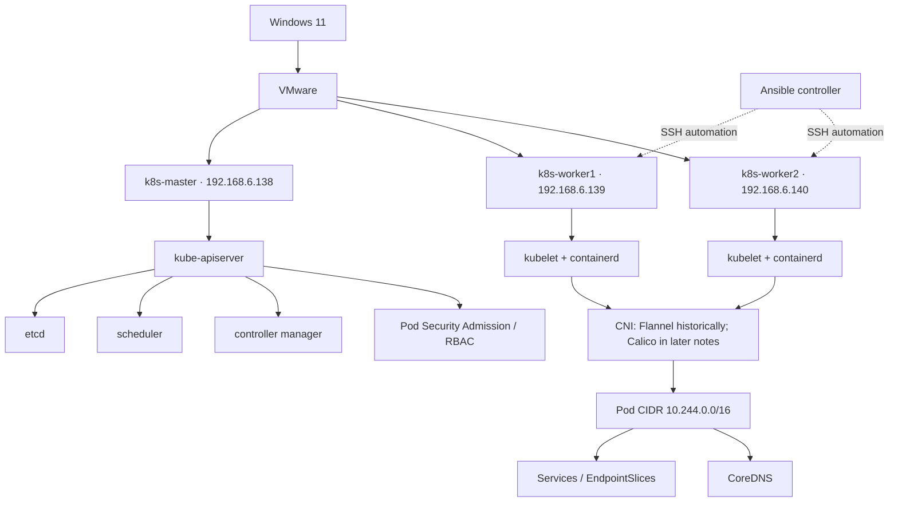
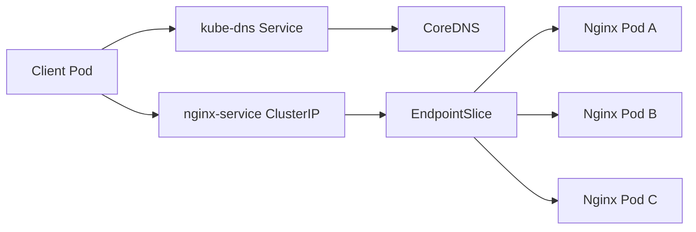
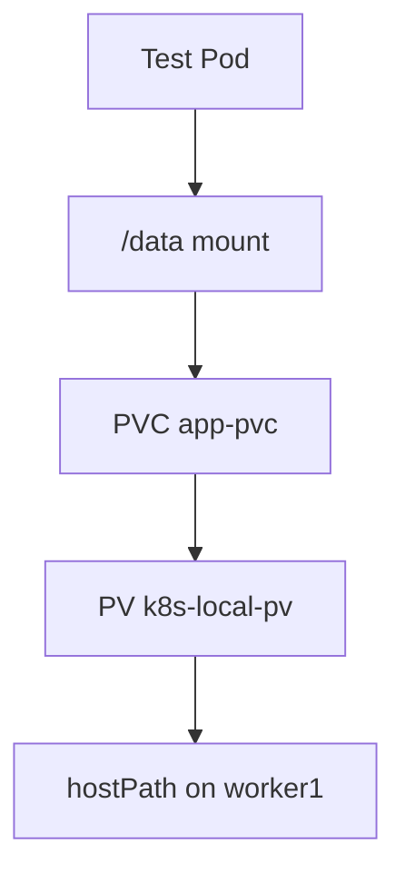
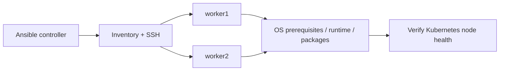

# Architecture Diagrams

## Full cluster

```mermaid
flowchart TB
  Host["Windows 11"] --> VMware["VMware"]
  VMware --> CP["k8s-master · 192.168.6.138"]
  VMware --> W1["k8s-worker1 · 192.168.6.139"]
  VMware --> W2["k8s-worker2 · 192.168.6.140"]
  CP --> API["kube-apiserver"]
  API --> ETCD["etcd"]
  API --> SCH["scheduler"]
  API --> CCM["controller manager"]
  W1 --> K1["kubelet + containerd"]
  W2 --> K2["kubelet + containerd"]
  K1 --> CNI["CNI: Flannel historically; Calico in later notes"]
  K2 --> CNI
  CNI --> Pods["Pod CIDR 10.244.0.0/16"]
  Pods --> Services["Services / EndpointSlices"]
  Pods --> DNS["CoreDNS"]
  API --> Security["Pod Security Admission / RBAC"]
  Ansible["Ansible controller"] -. SSH automation .-> W1
  Ansible -. SSH automation .-> W2
```

## Service traffic

```mermaid
flowchart LR
  Client["Client Pod"] --> DNS["kube-dns Service"] --> CoreDNS["CoreDNS"]
  Client --> SVC["nginx-service ClusterIP"] --> EPS["EndpointSlice"]
  EPS --> P1["Nginx Pod A"]
  EPS --> P2["Nginx Pod B"]
  EPS --> P3["Nginx Pod C"]
```

## Persistent storage

```mermaid
flowchart TB
  Pod["Test Pod"] --> Mount["/data mount"] --> PVC["PVC app-pvc"] --> PV["PV k8s-local-pv"] --> HostPath["hostPath on worker1"]
```

## Ansible

```mermaid
flowchart LR
  A["Ansible controller"] --> SSH["Inventory + SSH"] --> W1["worker1"] 
  SSH --> W2["worker2"]
  W1 --> Prep["OS prerequisites / runtime / packages"]
  W2 --> Prep
  Prep --> Verify["Verify Kubernetes node health"]
```
